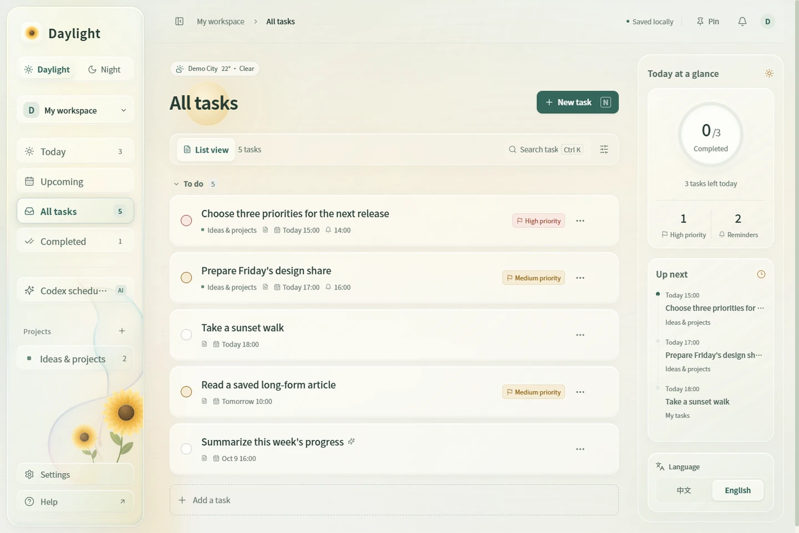

# Daylight

[ENG](README.md) · [简体中文](README.zh-CN.md)

A Windows task app that follows the light, weather, and rhythm of your day. Plan locally, enjoy liquid glass and changing skies, and connect your task list to Codex.

**Windows x64 · v0.3.0 · English / 中文 · Local storage**

[Download](https://github.com/Key07211/daylight/releases/latest) · [English demo](https://key07211.github.io/daylight/demo.html?lang=en) · [中文演示](https://key07211.github.io/daylight/demo.html?lang=zh) · [User guide (中文)](docs/USER_GUIDE.md) · [MCP guide (中文)](docs/MCP_GUIDE.md)



## Get started

Download `Daylight-Setup-0.3.0.exe` from [Releases](https://github.com/Key07211/daylight/releases/latest), close any older version, and follow the installer. Open Daylight from the desktop or Start menu. No separate Node.js installation is needed. The installed app supports automatic Codex MCP connection and optional launch at Windows sign-in.

For the portable edition, extract `Daylight-Portable-0.3.0.zip` and run the included app. It does not register MCP or launch at sign-in. Both editions share `%APPDATA%\Daylight` on the computer; run only one at a time. Portable data is not stored beside the executable.

Release executables are **unsigned**, so Windows may show an unknown-publisher warning. SHA-256 checksums and a validation summary are included on the release page.

Project filtering is available in the current source and demo. Windows downloads remain the existing v0.3.0 build.

## Features

| Feature | What it does |
| --- | --- |
| Tasks and projects | Create, edit, search, filter by project (including General), set priorities and deadlines; confirm completion and deletion |
| Reminders | Set a separate reminder time, use the notification center and optional Windows notifications, keep running in the tray |
| Day and night | Follow the computer's clock: day at 07:00, night at 19:00; a manual choice lasts until the next switch or full exit |
| Weather and openings | City-based clouds, rain, and snow; a sun moving toward the current time, a brightening moon, and descending stars |
| Liquid glass | Adjust transparency, blur, and highlights; watch rain slide into the glass edge and sunflowers react to droplets |
| Desktop controls | Always-on-top, tray controls, English / Chinese, reduced motion, and JSON export |
| Codex MCP | Let Codex read and manage tasks, notifications, and run results through 14 tools |
| Codex scheduling | Give a task a prompt, working directory, execution time, and repeat rule for the local `codex exec` command |

Weather uses network-based location and Open-Meteo; you can correct the city manually. The weather city's time zone does not change the day/night schedule. Tasks work offline, while weather uses cached information or becomes unavailable. Reminders and scheduled runs need the app running and the computer awake.

## Connect with Codex

**Manage the list from Codex.** The installed app detects the local Codex CLI, registers a missing MCP connection, and checks the handshake, tool list, and read-only service status. Version 0.3.0 can migrate a verified older source-code connection to the installed app while preserving permissions and other settings. Disabled, unknown, or custom connections remain unchanged. See the [MCP guide](docs/MCP_GUIDE.md).

Refresh the connection in Codex's MCP settings, or restart Codex and open a new chat. Try:

> Show today's unfinished Daylight tasks.
>
> Create “Review reading notes” in Daylight, due tomorrow at 8 PM, with a reminder at 7:30 PM.

**Schedule Codex from the list.** Enable automatic execution in a task's details, then set its working directory, prompt, and run time. The default sandbox is read-only; workspace writes are optional. Scheduling needs the Codex CLI, a valid sign-in, and internet access, and uses your Codex account allowance. It is separate from Codex desktop Automations. Installing Daylight does not create AI jobs.

MCP edits take effect directly, without the app's confirmation dialogs, so identify the target task clearly. Daylight listens only on the local loopback address and does not sync across devices.

## Product demo

Explore the animated walkthrough in [English](https://key07211.github.io/daylight/demo.html?lang=en) or [中文](https://key07211.github.io/daylight/demo.html?lang=zh). Day, night, rain, and opening scenes play automatically with a visible pause control. Reduced-motion preferences start the demo with still previews; you can opt into playback. The language switch changes both the page text and its sample app captures. The demo uses isolated example tasks and does not change your real list or run Codex.

For offline viewing, download `Daylight-Demo-0.3.0.zip` from Releases, extract it, and open `docs/demo.html` in a browser. Keep the accompanying files together. The repository also includes the [demo page](docs/demo.html) and [demo notes](docs/DEMO.md).

The original [Figma v1 design](https://www.figma.com/design/UHEyr1qqi1WspOuH8QJVvP) records the early concept. Current visuals and motion are implemented in the app; see the [design notes](design/day-night-spec.md).

## Data and privacy

Both desktop editions store tasks at `%APPDATA%\Daylight\data\store.json`. Open the data folder from Settings. Updates and uninstalling preserve tasks by default. Export JSON for a backup; there is currently no import button. Recovery instructions are in the [user guide](docs/USER_GUIDE.md).

The source server uses the project's `data/` folder by default. Real tasks, logs, Codex configuration, installers, and local runtime records are excluded from this repository. Weather requests use the network, and content sent to Codex is processed through Codex online.

## Run from source

Requires Windows, Node.js 22.12 or later, and npm.

```powershell
npm ci
npm test
npm run build
npm run desktop
```

`npm run desktop` uses the normal desktop data folder. For isolated sample data, use `npm run desktop:preview`; reminders, automatic execution, and MCP registration are disabled in that preview.

For frontend development, run `npm start` and `npm run dev` in separate terminals. `Start-Daylight.cmd` and `Stop-Daylight.cmd` control the source web server; the installed desktop app does not need them. The server defaults to `127.0.0.1:4317`, so avoid running it alongside the desktop app on the same port.

## Build and verify

```powershell
npm run package:win
node desktop/smoke-packaged.mjs
node desktop/smoke-portable.mjs
node desktop/verify-installer.mjs
node desktop/smoke-mcp-migration.mjs
```

The build produces an NSIS installer and a portable executable. Checks use isolated data and ports to cover task actions, native integration, a real MCP stdio handshake, and portable startup. Migration checks require the local Codex CLI and an isolated `CODEX_HOME`. Installer verification extracts the payload and compares hashes; it does not replace an installation test. `VALIDATION-0.3.0.json` in the release records the published build's results.

For system-clock and opening regressions:

```powershell
.\node_modules\.bin\electron desktop/startup-clock-smoke.cjs
.\node_modules\.bin\electron desktop/startup-smoke.cjs
```

These checks simulate time without changing Windows time, your real Codex configuration, or running real AI jobs.

For project filters and the bilingual animated demo, run after `npm run build`:

```powershell
.\node_modules\.bin\electron.cmd desktop/project-filter-smoke.cjs
.\node_modules\.bin\electron.cmd desktop/product-demo.cjs --verify-docs
.\node_modules\.bin\electron.cmd desktop/demo-motion-smoke.cjs
```

## Repository layout

```text
src/              React interface, themes, and weather motion
desktop/          Electron window, tray, MCP connection, and checks
server/           Local API, storage, reminders, and Codex scheduling
integrations/     MCP stdio server and integration tests
scripts/          Source-server and manual connection scripts
tests/            Unit and integration tests
docs/             Guides, demo page, and demo media
design/           Design notes and early Figma scripts
```

MCP uses the official `@modelcontextprotocol/sdk`. See the [official Codex MCP documentation](https://learn.chatgpt.com/docs/extend/mcp?surface=cli) for configuration semantics. The desktop window uses context isolation, renderer sandboxing, and a restricted native interface.
