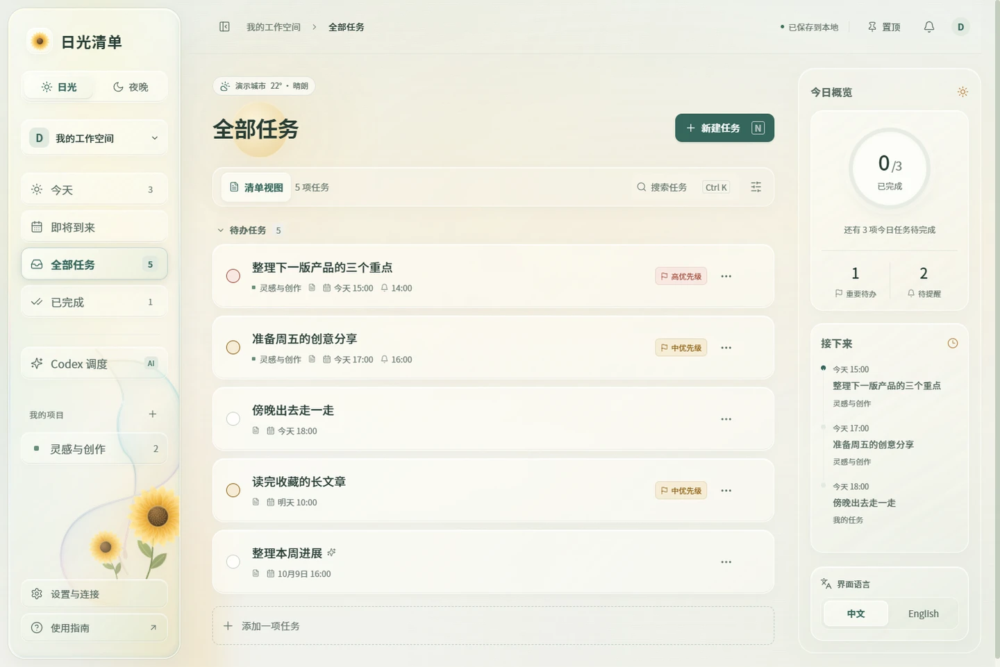

# Daylight · 日光与夜光清单

[English](README.md) · **简体中文**

一份随时间与天气变化的 Windows 桌面清单。用液态玻璃、向日葵、月光与雨窗陪伴日常工作，也能让本机 Codex 管理任务。

**Windows x64 · v0.4.0 · 中文 / English · 本地保存**

[下载](https://github.com/Key07211/daylight/releases/latest) · [中文演示](https://key07211.github.io/daylight/demo.html?lang=zh) · [English demo](https://key07211.github.io/daylight/demo.html?lang=en) · [使用手册](docs/USER_GUIDE.md) · [MCP 连接指南](docs/MCP_GUIDE.md)



## 开始使用

在 [Releases](https://github.com/Key07211/daylight/releases/latest) 下载最新的 `Daylight-Setup-<version>.exe`，退出旧版后按向导安装。从桌面或开始菜单打开 Daylight，无需另外安装 Node.js。安装版支持 Codex MCP 自动连接，也可设为登录 Windows 时启动。

免安装版下载 `Daylight-Portable-<version>.zip`，解压后运行其中的程序。它不登记 MCP，也不注册登录启动。两个版本共用本机 `%APPDATA%\Daylight`，一次只运行一个版本；免安装版的数据不会保存在程序旁边。

发行程序**尚未签名**，Windows 可能显示未知发布者。发布页附有 SHA-256 校验值及验证摘要。

从 v0.4.0 起，安装版启动后及运行期间每六小时自动检查更新。置顶右侧的蓝色圆点可打开可用更新；点击**下载并立即重启**后才下载，校验完成即安装并重启，没有倒计时。正在编辑的任务或执行中的 Codex 任务会先等待完成。旧版需要先手动安装一次才能启用此功能，免安装版仍手动更新。详见[更新指南](docs/UPDATES.zh-CN.md)。

## 主要功能

| 功能 | 行为 |
| --- | --- |
| 任务与项目 | 新建、编辑、搜索、按项目筛选（含“常规”）、优先级、截止时间；完成和删除前确认 |
| 提醒 | 独立设置提醒时间，通知中心与可选 Windows 通知；关闭窗口后继续托盘运行 |
| 日光与夜晚 | 按电脑时间 07:00 切入日光、19:00 切入夜晚；手动选择保留至下个切换点或完全退出 |
| 天气与开场 | 按城市天气呈现云雨雪；太阳沿轨迹移至当前时间，夜间月亮渐亮、悬星落下 |
| 液态玻璃 | 可调通透度、模糊、高光；雨珠滑落并汇入玻璃底边，向日葵随雨轻颤 |
| 桌面控制 | 窗口置顶、托盘、中英文切换、减少动态、JSON 导出 |
| 版本更新 | 自动检查版本、置顶右侧蓝色圆点、下载进度，主动下载完成后自动安装并重启 |
| Codex MCP | Codex 查询和管理清单、通知与执行结果，共 14 个工具 |
| Codex 调度 | 为任务配置提示词、目录、时间和重复规则，调用本机 `codex exec` |

天气通过网络定位和 Open-Meteo 获取，可手动修正城市。天气城市的时区不会改变电脑的日夜切换规则。离线时仍可管理任务，天气会使用缓存或显示不可用。提醒与调度要求应用运行、电脑处于唤醒状态。

## 连接 Codex

**让 Codex 管理清单。** 安装版会检测本机 Codex CLI，登记缺失的 MCP 连接，并验证握手、工具列表和只读服务状态。0.3.0 可将经过身份与桥接文件验证的旧源码连接迁移到安装目录，保留现有权限和其他配置；禁用、未知或自定义连接保持原样。详见 [MCP 连接指南](docs/MCP_GUIDE.md)。

在 Codex 的 MCP 设置中刷新连接，或重启 Codex 后打开新聊天，可以这样说：

> 查看 Daylight 今天尚未完成的任务。
>
> 在 Daylight 新建“整理阅读笔记”，明天 20:00 截止，19:30 提醒。

**让清单调度 Codex。** 在任务详情中主动开启自动执行，填写工作目录、提示词和执行时间。默认使用只读沙箱，可按需要选择工作区写入。该功能需要 Codex CLI、有效登录与网络，运行会使用 Codex 账户用量。它与 Codex 桌面内置 Automations 独立，安装 Daylight 不会自动创建 AI 作业。

MCP 的任务修改直接生效，不经过应用界面的确认弹窗；调用时请明确要操作的任务。Daylight 只监听本机回环地址，不提供跨设备同步。

## 产品演示

打开[中文动态演示](https://key07211.github.io/daylight/demo.html?lang=zh)或[英文动态演示](https://key07211.github.io/daylight/demo.html?lang=en)。日光、夜晚、雨天和开场画面自动播放，并提供暂停按钮。系统开启“减少动态效果”时，默认显示静止预览，也可主动播放。语言按钮会同时切换页面文案与示例界面截图。演示使用独立的示例任务，不会修改真实清单或执行 Codex。

离线查看时，从 Releases 下载 `Daylight-Demo-<version>.zip`，解压后用浏览器打开 `docs/demo.html`，并保留随附文件的目录结构。本仓库也包含[演示页面](docs/demo.html)与[演示说明](docs/DEMO.zh-CN.md)。

原始 [Figma v1 设计稿](https://www.figma.com/design/UHEyr1qqi1WspOuH8QJVvP) 保留了早期构思。当前视觉与天气动效以应用实装为准，见[设计说明](design/day-night-spec.md)。

## 数据与隐私

安装版和免安装版任务均位于 `%APPDATA%\Daylight\data\store.json`，可从设置打开数据目录。更新和卸载默认保留任务。使用导出功能可保存 JSON 备份；当前没有界面导入按钮，恢复步骤见[使用手册](docs/USER_GUIDE.md)。

源码服务默认使用项目内的 `data/`。真实任务、日志、Codex 配置、安装包和本机运行记录都不进入 Git 仓库。天气查询与 GitHub 更新检查需要联网；更新检查不会发送任务清单。传给 Codex 的内容仍会由 Codex 联网处理。

## 从源码运行

需要 Windows、Node.js 22.12 或更新版本及 npm。

```powershell
npm ci
npm test
npm run build
npm run desktop
```

`npm run desktop` 使用正式桌面数据目录。仅想体验示例时运行 `npm run desktop:preview`，它使用独立数据，并停用提醒、自动执行及 MCP 登记。

开发前端可在两个终端分别运行 `npm start` 和 `npm run dev`。`Start-Daylight.cmd` / `Stop-Daylight.cmd` 提供源码网页服务的启动与停止，桌面安装版无需这些脚本。服务默认监听 `127.0.0.1:4317`，避免与正式应用同时占用端口。

## 构建与验证

```powershell
npm run package:win
node desktop/smoke-packaged.mjs
node desktop/smoke-portable.mjs
node desktop/verify-installer.mjs
node desktop/smoke-mcp-migration.mjs
node scripts/verify-update-release.mjs
.\node_modules\.bin\electron.cmd desktop/update-download-smoke.cjs
```

构建生成 NSIS 安装器、免安装程序及更新清单。检查使用独立数据和端口，验证任务操作、原生接口、真实 MCP stdio 握手以及免安装启动。迁移检查需要本机 Codex CLI，使用独立的 `CODEX_HOME`；安装器检查提取载荷并比较哈希，不代替实际安装体验测试。发布包的 `VALIDATION-<version>.json` 记录该版本的检查结果。推送匹配版本的标签会运行 [Windows 发布流程](.github/workflows/release.yml)，详见[发布新版本](docs/UPDATES.zh-CN.md#发布新版本)。

系统时间与开场回归：

```powershell
.\node_modules\.bin\electron desktop/startup-clock-smoke.cjs
.\node_modules\.bin\electron desktop/startup-smoke.cjs
```

这些检查模拟时钟，不调整 Windows 时间、不修改真实 Codex 配置，也不执行真实 AI 作业。

执行 `npm run build` 后，可验证项目筛选与双语动态演示：

```powershell
.\node_modules\.bin\electron.cmd desktop/project-filter-smoke.cjs
.\node_modules\.bin\electron.cmd desktop/product-demo.cjs --verify-docs
.\node_modules\.bin\electron.cmd desktop/demo-motion-smoke.cjs
```

## 代码结构

```text
src/              React 界面、主题与天气动效
desktop/          Electron 窗口、托盘、MCP 连接与验证工具
server/           本地 API、数据、提醒与 Codex 调度
integrations/     MCP stdio 服务及集成测试
scripts/          源码服务与手动连接脚本
tests/            单元与集成测试
docs/             使用指南、演示页面与演示素材
design/           设计说明与早期 Figma 构建脚本
```

MCP 基于官方 `@modelcontextprotocol/sdk`。配置语义见 [Codex 官方 MCP 文档](https://learn.chatgpt.com/docs/extend/mcp?surface=cli)。桌面窗口启用上下文隔离、渲染沙箱和限定的原生接口。
