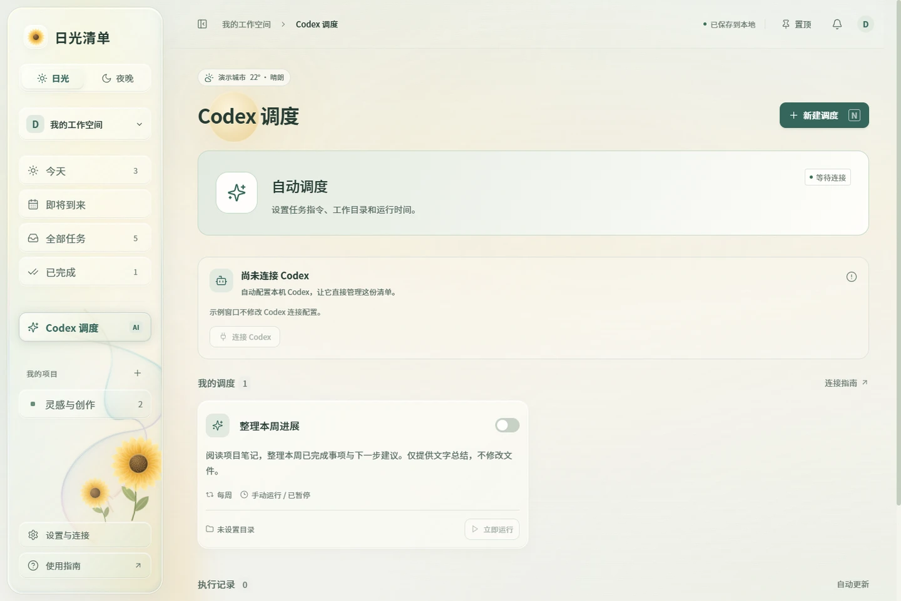

# Daylight 的 MCP 与 Codex 指南

本指南适用于 Daylight 0.3.0，说明如何让 Codex 访问 Daylight，以及如何从 Daylight 启动 Codex 作业。普通任务、提醒和外观设置见[使用手册](USER_GUIDE.md)；下载入口见[项目首页](../README.md)。

## 先分清连接与执行

| 能力 | 操作方向 | 使用场景 |
| --- | --- | --- |
| MCP 工具 | Codex → Daylight | 在聊天中查看任务、新建待办、修改提醒、读取执行结果 |
| 本地调度 | Daylight → Codex CLI | 按时间或点击「立即运行」，让 Codex 分析、生成或修改工作目录中的内容 |

MCP 就绪只表示工具和本地服务可访问，不表示你已经启用定时作业，也不代表模型登录和每项指令一定能成功。调度需要另外填写指令、工作目录、时间与权限。Daylight 的调度不会自动创建或同步 Codex 内置的 Automations。



## 用安装版连接 Codex

1. 在本机准备好 Codex。需要执行模型任务时，确保 CLI 已登录。
2. 打开 **Daylight 安装版**并保持运行。
3. 进入「设置与连接」，找到 Codex 连接卡片；「Codex 调度」页面也会显示连接状态。
4. 保持「启动时自动连接」开启，或点击「连接 Codex」。
5. 看到「Codex 工具已就绪」后，在 Codex 中刷新 MCP 连接；如果工具仍未出现，重启 Codex，再打开一个新聊天尝试下面的示例指令。

首次登记或连接迁移后的旧聊天不保证立即加载新工具。可以先在新聊天里要求 Codex 读取 Daylight 状态和任务列表，确认连接的是预期的本地清单。

连接检查会读取登记信息、完成 MCP 握手、列出工具并调用只读状态工具，不会为了测试而新建任务或执行模型作业。正常提供 14 个工具；如果你在 Codex 配置中限制了部分工具，可用数量可能更少。

### 版本与启动方式

| 启动方式 | MCP 行为 |
| --- | --- |
| Windows 安装版 | 支持自动登记、检查与重试，适合长期使用 |
| 免安装版 | 不自动登记 MCP；已有有效连接可访问正在运行的本地服务 |
| `npm run desktop` | 源码桌面应用，可配置 MCP，使用正式桌面数据目录 |
| `npm run desktop:preview` | 独立示例窗口，不修改真实 Codex 连接配置 |
| 源码 Web 服务 | 先运行服务，再使用仓库中的手动登记脚本 |

「启动时自动连接」只控制 Daylight 启动时是否尝试配置连接。关闭它不会删除 Codex 中已有的登记，也不会暂停已经配置的任务调度。

### 从源码桌面版升级到安装版

0.3.0 安装版可以修复符合条件的旧源码桌面 MCP 连接。启用「启动时自动连接」或点击「连接 Codex」时，应用会核对原登记来自 Daylight 源码桌面的 Electron 与桥接程序、桥接内容与安装版一致，并确认该连接已启用。启动变量须满足 `ELECTRON_RUN_AS_NODE=1`，且 `DAYLIGHT_URL` 指向相同的本地服务地址；其他额外环境变量允许保留。

核对通过后，应用先备份 Codex 配置，再只替换 Daylight 连接的程序路径与参数。原来的工具允许／禁用列表、超时、额外环境变量及其他设置会保留。迁移并通过连接检查后，界面才显示工具已就绪；按上面的步骤刷新 MCP 或重启 Codex 后使用新聊天。

备份位于当前生效的 `config.toml` 旁，文件名形如 `config.toml.daylight-backup-<时间>-<唯一标识>`。Codex 设置了 `CODEX_HOME` 时使用该目录，否则通常位于用户目录的 `.codex`。备份可能含有个人配置，应妥善保留。

以下情况不会自动改写：已停用的连接、来源不明或非预期程序布局的同名配置、不同服务地址／启动变量、任意 Node 脚本登记、指向不同目录的旧安装版，以及不能安全修改的配置文件。免安装版也不执行迁移。这些情况应核对 Codex 中的现有路径与设置后手动处理；「检查连接」按钮始终只读，不负责修复。

### 连接状态怎么读

| 界面状态 | 含义与下一步 |
| --- | --- |
| 正在检查连接 | 等待当前检查结束 |
| Codex 工具已就绪 | 工具与本地服务检查通过；首次连接或迁移后刷新 MCP，必要时重启 Codex，再用新聊天测试 |
| 尚未连接 Codex | 点击「连接 Codex」，或开启启动时自动连接 |
| Codex 暂不可用 | 检查本机 Codex 安装，重新打开 Daylight；确认当前不是示例或受限启动方式 |
| MCP 已停用 | 先在 Codex 的 MCP 设置中启用 Daylight |
| 连接配置需调整 | 存在不同的同名配置，在 Codex 中核对路径和本地服务地址 |
| 连接测试未通过 | 保持 Daylight 运行，检查端口及程序路径，再点击重试 |

已有同名、停用或自定义连接时，不要反复删除后重建。先查看配置，尤其是你已经设置过的工具允许列表、禁用列表及额外环境变量。

## 让 Codex 管理清单

可以直接用自然语言说明目标，不必记住工具名称。例如：

> 查看 Daylight 今天到期且尚未完成的任务，按优先级列出。先只查看。

> 在 Daylight 新建“整理本周笔记”，明天晚上八点截止，提前十五分钟提醒。使用电脑本地时区，不配置自动执行。

> 找到“整理本周笔记”，把截止时间改到周五下午五点；其余字段保持不变。如果有同名任务，先列出供我选择。

> 将“整理本周笔记”标记为完成。

> 查看最近一次 Codex 执行记录，概括失败原因，不重新运行。

> 导出 Daylight 数据，并把返回的 JSON 保存为备份文件。

任务工具直接写入本地服务。通过 MCP 完成或删除任务时，不会弹出 Daylight 圆圈完成操作使用的确认框。清楚描述目标；有同名任务时，先查询再根据 ID 操作。删除没有回收站。

### 14 个工具

| 工具 | 功能 | 主要输入 |
| --- | --- | --- |
| `daylight_status` | 读取服务地址、提醒设置与 CLI 可用状态 | 无 |
| `daylight_list_tasks` | 查询任务并返回稳定 ID | 完成状态、项目、优先级、关键词、到期范围，可选 |
| `daylight_add_task` | 新建任务，可带提醒或明确要求的调度 | 标题及可选任务字段 |
| `daylight_update_task` | 修改任务，或完成／恢复任务 | 任务 ID 与要修改的字段 |
| `daylight_delete_task` | 删除指定任务 | 任务 ID |
| `daylight_list_projects` | 列出项目及 ID | 无 |
| `daylight_add_project` | 创建项目 | 名称，可选颜色 |
| `daylight_list_runs` | 读取执行历史及输出，不启动作业 | 无 |
| `daylight_run_task` | 立即运行任务中已配置的 Codex 指令 | 任务 ID |
| `daylight_cancel_run` | 停止正在运行的作业 | 执行记录 ID |
| `daylight_update_settings` | 开启／关闭桌面提醒 | `desktopNotifications` 布尔值 |
| `daylight_list_notifications` | 读取任务提醒及运行结果通知 | 无 |
| `daylight_mark_notification` | 将通知设为已读或未读 | 通知 ID、`read` 布尔值 |
| `daylight_export` | 返回完整任务数据导出 | 无 |

`daylight_export` 只返回数据，本身不会在磁盘创建备份文件。需要在指令中另外要求 Codex 保存，或者直接在 Daylight 设置中点击「导出 JSON 备份」。当前没有对应的导入工具。

### 字段和日期规则

给 Codex 自然语言指令时，通常由它组织工具参数。调试或自行接入时，注意以下约定：

- 任务字段包括 `title`、`notes`、`projectId`、`priority`、`dueAt`、`reminderAt`、`completed` 和 `automation`。
- 优先级为 `high`、`medium`、`low`。项目必须引用已有 ID；使用 `null` 可取消项目归属。
- 日期使用**包含时区的 ISO 时间**，例如 `2030-05-10T17:00:00-07:00`。这只是格式示例，应按实际日期和当地时区选择偏移。
- 更新时省略的字段保持原值；`dueAt`、`reminderAt` 或 `projectId` 设为 `null` 可清除对应值。
- `completed: true` 完成任务，`false` 恢复任务；没有单独的完成工具。
- `dueAfter` 和 `dueBefore` 的边界都包含在查询范围内。未设置到期时间的任务不会匹配日期范围查询。
- 任务 ID、项目 ID、通知 ID 和执行记录 ID 是不同的对象标识，先查询再使用。

MCP 不提供修改语言、主题、玻璃样式、窗口置顶或天气城市的工具；这些功能在应用界面中设置。

## 让 Daylight 运行 Codex

### 准备好本机 CLI

在终端检查：

```powershell
codex --version
codex login status
```

若尚未登录，运行 `codex login`，按照 Codex 自身流程完成登录。安装或更新 CLI 后，重新打开 Daylight，使它重新检测。仅有“MCP 已就绪”并不能代替模型登录检查。

### 先手动运行，再设置时间

1. 打开未完成任务，展开「交给 Codex」。
2. 填写具体指令，说明要检查的内容、期望输出，以及是否允许改动文件。
3. 填写已存在的工作目录**完整路径**，例如 `C:\Projects\example`；请换成自己的实际目录。
4. 选择文件访问权限并保存。
5. 在「Codex 调度」点击「立即运行」，查看执行详情。
6. 需要按时执行时，再启用定时执行并设置首次时间与重复方式。

| 权限 | 适合的任务 |
| --- | --- |
| `read-only`／只读 | 阅读、分析、检查；结果可显示在执行输出中 |
| `workspace-write`／允许写入工作目录 | 在指定工作目录生成或修改文件 |

例如，要求“分析文档并给出建议”可以用只读；要求“把建议写成目录中的报告文件”则需要相应写入权限。Daylight 会把执行指令交给 `codex exec`，不会代替 Codex 扩大其沙箱权限。

重复方式为不重复、每天、工作日和每周。时间使用电脑本地时区。调度暂停后仍可手动运行；折叠配置区域不会暂停调度。已完成的任务不会自动运行，立即运行前也需要先恢复为未完成。

### 运行记录、取消和恢复

当前同一时刻只执行一项作业，单次最长 30 分钟。执行详情显示状态、输出、耗时和错误；运行中的任务可点击「取消执行」。取消或退出 Daylight 后，已经产生的文件和输出不会回滚。

成功执行不会自动完成清单中的任务。一次性定时任务开始执行后，定时开关会关闭；重复任务会推进到下一次时间。即使某次启动失败，也应查看记录并核对下一次安排，不要假设它会反复重试当前时刻。

电脑睡眠或服务停止时无法准时执行。恢复后，到期任务可能被处理；重复调度不会补跑每一个错过的时段。意外中断的运行会在重启后标记失败，不自动重新执行那次记录。

模型执行需要网络、有效登录和可用额度。Daylight 本地调度与 Codex 自身的账户用量、权限以及审批规则仍分别生效。

## 源码用户手动登记

如果使用仓库的 Node 服务而非 Windows 安装版，先按[项目首页](../README.md)启动本地服务，再在仓库根目录运行：

```powershell
powershell.exe -NoProfile -ExecutionPolicy Bypass -File .\scripts\Install-Codex-MCP.ps1
```

脚本会检查已有的 Daylight 登记，并验证工具连接。不要把另一台电脑的绝对路径直接复制到自己的配置。

需要查看当前配置时可以使用：

```powershell
codex mcp list
codex mcp get daylight --json
```

默认服务地址是 `http://127.0.0.1:4317`。桥接使用 MCP stdio 与 Codex 通信，再访问这个本地 HTTP 服务；只接受回环地址。任务写操作通过本地 API 完成，不直接编辑 `store.json`。

如果改了服务端口，MCP 的 `DAYLIGHT_URL` 必须指向同一个地址。自定义配置、工具权限和更完整的 MCP 用法见 [OpenAI 官方 MCP 文档](https://learn.chatgpt.com/docs/extend/mcp?surface=cli)。

### 停用和移除连接

可以在 Codex 的 MCP 设置中停用 Daylight。若确定要移除登记，可运行：

```powershell
codex mcp remove daylight
```

这不会删除任务。若同时不希望 Daylight 在下次启动时重新登记，先在应用设置里关闭「启动时自动连接」。停用或移除 MCP 也不会暂停 Daylight 中已经启用的本地调度；需要分别关闭它们。

## 连接和运行排查

| 问题 | 如何排查 |
| --- | --- |
| Codex 聊天里没有 Daylight 工具 | 确认已就绪，保持应用运行，刷新 MCP 或重启 Codex，再打开一个新聊天；检查是否停用了连接或部分工具 |
| 工具提示无法连接本地服务 | 打开 Daylight；确认只运行一个版本，且服务端口与 `DAYLIGHT_URL` 一致 |
| 安装后显示不同的 Daylight 配置 | 查看 Codex MCP 设置中的程序路径、桥接路径和地址；保留自定义工具策略，不要盲目反复删除登记 |
| 连接显示就绪，但调度失败 | 查看执行记录；分别检查 CLI 登录、工作目录、权限、网络和账户用量 |
| 找不到 CLI | 在终端检查 `codex --version`；完成安装或更新后重新打开 Daylight |
| 工作目录不存在 | 使用本机实际存在的完整目录路径；目录移动后同步修改任务配置 |
| 只读任务不能生成文件 | 若任务确实需要落盘，改为允许写入工作目录，并明确输出位置 |
| 已有作业正在运行 | 等待它结束，或在执行详情中取消，再启动新的作业 |
| 任务已完成，无法运行 | 先在清单中恢复为未完成，再检查调度是否仍符合预期 |
| 30 分钟后失败 | 查看超时记录，将任务拆小，减少一次执行的范围 |
| 执行被取消后仍有文件 | 取消只停止后续执行，不撤销已经完成的文件操作 |
| 想彻底停止自动作业 | 暂停各任务的定时执行，或退出 Daylight；只关闭 MCP 自动连接不够 |

提交问题时，可以提供应用版本、连接状态和经过脱敏的错误信息。不要公开完整任务导出、个人工作目录、Codex 登录信息或未经检查的运行输出。

返回[使用手册](USER_GUIDE.md) · 返回[项目首页](../README.md)
