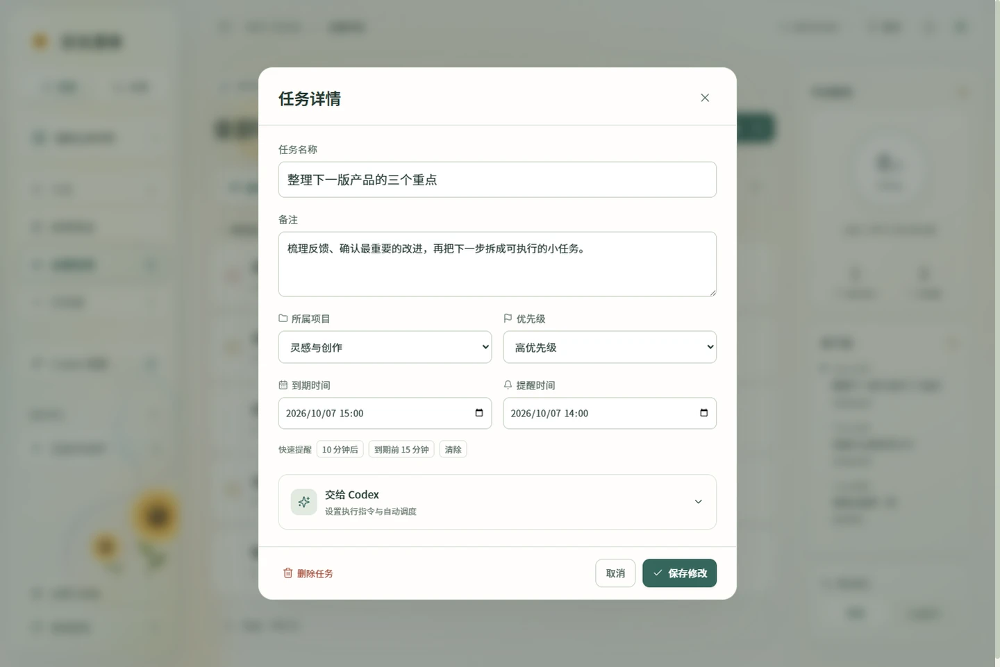
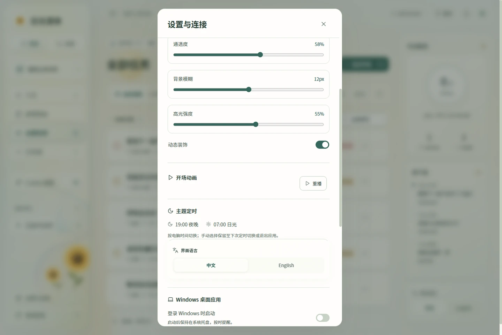

# Daylight 使用手册

Daylight 是 Windows 本地任务清单。你可以整理任务、设置提醒，也可以让 Codex 管理清单，或让 Daylight 按时运行 Codex 指令。普通清单功能无需注册 Daylight 账号。本手册适用于 0.3.0。

下载入口和当前版本见[项目首页](../README.md)。Codex 的连接、工具和调度配置见 [MCP 与 Codex 指南](MCP_GUIDE.md)。本手册中的任务名称均为示例。

想先看一遍操作，可以下载仓库后在浏览器打开[离线产品演示](demo.html)。它展示示例截图与动画，不会写入你的任务。

## 先完成一项小任务

1. 安装并打开 Daylight；开场右上角可以跳过，也可以按 `Esc`。
2. 点击「新建任务」，填写“整理本周笔记”。
3. 选择一个到期时间；如果需要提醒，另外填写提醒时间。
4. 保存后，点击任务标题可以修改详情。
5. 点击左侧圆圈，检查确认框中的任务名称，再点击「确认完成」。

完成的任务可以在「已完成」中找到。再次点击它的圆圈即可恢复为待办。

## 选择安装版或免安装版

两个版本都适用于 Windows x64，均自带运行环境，无需另装 Node.js。

| 版本 | 如何打开 | 适合的用法 |
| --- | --- | --- |
| 安装版 | 运行 `Daylight-Setup-0.3.0.exe`，按向导安装，再从桌面或开始菜单打开 | 日常使用、Codex MCP 自动连接、登录 Windows 后启动 |
| 免安装版 | 将 `Daylight-Portable-0.3.0.zip` 完整解压，运行其中的同名 `.exe` | 先体验应用，或不希望安装程序 |

安装版默认安装到当前 Windows 用户，无需管理员权限。更新前，请在系统托盘中退出旧版 Daylight，避免文件被占用。正常更新不会清空任务。

免安装程序首次打开时需要短暂解包。它的任务仍保存在本机 `%APPDATA%\Daylight`，与安装版共用数据，**不会随 ZIP 一起携带**。一次只运行其中一个版本。免安装版不提供 MCP 自动登记和 Windows 登录启动；已有可用的 MCP 连接仍能访问它运行的本地服务。

下载页会提供校验文件。可在下载目录打开 PowerShell，用 `Get-FileHash .\Daylight-Setup-0.3.0.exe -Algorithm SHA256` 计算摘要，与发布的校验值对照；免安装版请替换为对应 ZIP 文件名。是否已签名以对应发行说明为准。

## 认识主界面

左侧选择清单或项目，中间查看和编辑任务，右侧显示今日概览、近期到期任务及语言切换。窄窗口下，可通过左上角导航按钮展开侧栏。


| 入口 | 显示什么 |
| --- | --- |
| 今天 | 今天到期及已经逾期的任务；逾期项单独分组 |
| 即将到来 | 今天之后到期的任务，按日期分组 |
| 全部任务 | 所有项目中的任务，包括没有到期时间的任务 |
| 已完成 | 已确认完成的任务 |
| 我的项目 | 只看属于所选项目的任务 |
| Codex 调度 | 已配置 Codex 指令的任务，以及执行记录 |
| 设置与连接 | 天气、玻璃效果、开场、桌面行为、MCP 和备份 |

任务找不到时，先打开「全部任务」，清空搜索和优先级筛选。没有到期时间的任务不会出现在「今天」或「即将到来」。

## 创建、修改和整理任务

点击「新建任务」填写以下内容，再保存。任务详情中的日期、时间均按电脑本地时区输入和展示。

| 字段 | 用法 |
| --- | --- |
| 任务标题 | 简短描述要完成的事情，必填 |
| 备注 | 记录步骤、交付要求或参考链接文本 |
| 所属项目 | 选择已有项目；也可以使用「无项目」 |
| 优先级 | 高、中、低，用于标识和排序 |
| 到期时间 | 任务应在什么时候完成，可留空 |
| 提醒时间 | 什么时候通知你，与到期时间分开设置 |
| 交给 Codex | 可选的执行指令、工作目录和调度；普通任务无需填写 |

从「今天」新建任务时，会预填今天的到期时间，请保存前核对。从某个项目内新建任务时，会预选该项目。



### 修改、完成和删除

- **修改：**点击任务标题，修改内容并保存。正在编辑的内容要保存后才会写入本地。
- **完成：**点击任务圆圈，在确认框中点击「确认完成」。点击「取消」、按 `Esc` 或点击遮罩，会保留待办状态。
- **恢复：**打开「已完成」，点击对应圆圈，任务立即恢复为待办。
- **删除：**点击任务删除按钮或详情中的删除入口，在确认框中确认。当前没有回收站；需要留存的内容可先导出备份。

保存或删除处理中，弹窗会暂时阻止重复操作。出现错误时，查看提示并重试，不必连续点击。

通过 MCP 修改任务时，Codex 使用工具直接提交操作，不会在 Daylight 内弹出这些确认框。请在指令中明确对象和操作，详见 [MCP 指南](MCP_GUIDE.md#让-codex-管理清单)。

### 项目、搜索和筛选

点击左侧「我的项目」旁的加号，填写项目名称并选择颜色。随后在任务详情中选择「所属项目」。项目旁的数字表示该项目中的未完成任务数。

删除项目时，先打开该项目，再展开筛选区，点击「删除项目」并确认。项目中的任务会保留，移除项目归属后仍可在「全部任务」中找到。当前没有项目重命名入口。

任务列表支持按标题和备注搜索。打开筛选区，可以筛选优先级、切换排序方式，以及选择是否显示已完成任务。排序方式包括到期时间、优先级和创建时间。更换左侧清单后，搜索词与优先级筛选会清空。

| 快捷键 | 操作 |
| --- | --- |
| `N` | 新建任务；在输入框内打字或已有弹窗时不会触发 |
| `Ctrl + K` | 将焦点移到任务搜索框 |
| `Esc` | 关闭可取消的弹窗，或跳过开场 |

## 提醒、通知与托盘

**到期时间本身不会自动创建提醒。**在任务详情中填写「提醒时间」，或使用「10 分钟后」「到期前 15 分钟」快捷按钮；后者需要先设置到期时间。也可以清除提醒。

到时后，未完成任务的提醒会进入右上角铃铛中的通知列表。Codex 执行结果也会出现在这里。可以将通知标记为已读，或一次标记全部已读。

如需 Windows 弹出提醒，请在「设置与连接」开启桌面提醒。该开关默认关闭，关闭后应用内通知仍会保留。Windows 的通知权限、勿扰模式或专注设置也会影响弹出显示。

### 关窗口与退出应用的区别

| 操作 | 提醒和调度会怎样 |
| --- | --- |
| 关闭主窗口 | 应用收起到系统托盘，服务继续运行 |
| 点击托盘图标或「打开日光清单」 | 恢复原窗口，不重播开场 |
| 右键托盘 →「退出 Daylight」 | 完全退出，停止提醒服务和正在运行的 Codex 作业 |
| 电脑休眠、关机 | 无法在预定时刻提醒或执行任务 |

恢复运行后，尚未发出的到期提醒、已启用且到期的调度可能被处理。重复调度不会逐个补跑所有错过的周期。若不希望恢复后执行某项任务，可提前暂停它的调度。

安装版可以在「设置与连接」开启「登录 Windows 时启动」。该功能默认关闭；开启后登录时以托盘方式启动。它不会唤醒休眠电脑。

## 窗口、语言与视觉设置

### 置顶与语言

右上角「置顶」可让 Daylight 保持在其他窗口上方；再次点击取消，应用会记住这个选择。

右侧「中文 / English」或设置中的语言按钮可以切换界面语言。任务标题、备注与项目名称保持原文，不会自动翻译。语言偏好会保存到本机。

### 日光与夜晚

应用按 **Windows 系统时间和时区**切换主题：07:00 进入日光，19:00 进入夜晚。天气城市、VPN 出口时区和天气预览时间都不会改变这个规则。

左侧主题按钮可以临时切换。手动选择保留到下一个 07:00／19:00 切换点，或完全退出应用。收起到托盘、恢复窗口及同一窗口刷新会保留该选择；彻底退出再打开，则重新按系统时间判断。午夜不会单独清除仍有效的手动选择。

例如，晚上 22:00 临时切到日光，凌晨继续使用时仍是日光；次日 07:00 后恢复自动规则。如果凌晨完全退出再打开，则应进入夜晚。

### 液态玻璃

在「设置与连接 → 液态玻璃」中调整通透度、背景模糊和高光强度，也可以关闭动态装饰或恢复默认值。这些偏好会保存在本机。



若希望界面更安静或降低显卡负担，可关闭动态装饰。系统启用减少动态效果时，应用也会减少动画；隐藏窗口时，天气等环境动效会暂停。

### 开场动画

首次打开窗口时，会根据当前系统时间与可用天气呈现约四秒的开场。日间是太阳轨迹与向日葵，夜间是月光、悬星、银河与音符；雨天加入雨窗、水珠与微光。

点击右上角「跳过动画」或按 `Esc` 可直接进入清单。在「设置与连接 → 开场动画」可以重播。关闭动态装饰或启用系统减少动态效果后，应用直接进入清单，重播按钮相应停用。

## 天气与光照

点击页面上方的天气按钮，或打开「设置与连接 → 天气与光照」。

**实时天气**通过网络识别城市并获取天气，通常约每 15 分钟更新。网络定位反映的可能是 VPN 或运营商出口城市；搜索城市并点击结果，可以改为手动城市。点击「使用所在城市」恢复自动定位，刷新按钮可重新检查天气。

云量、雨雪等来自天气城市，界面中的实际时钟使用电脑时区。天气城市与电脑时区相同时，可以使用当天的日出日落数据；时区不一致或缺少数据时，使用本地 06:00–18:00 的估算太阳轨迹，并标注「估算」。

**效果预览**可模拟时间和晴、云、雨、雪、雾等效果。它只改变视觉，不会调整电脑时间、任务日期或提醒。预览在当前窗口会话内保留，彻底退出后重新打开恢复实时天气；手动选择的城市仍会保留。

断网时，应用会使用有效缓存并标明「缓存」，或显示天气不可用。天气获取失败不会阻止本地任务操作。天气服务来源见设置中的署名链接。

## 两种 Codex 用法

| 想做什么 | 使用哪项功能 |
| --- | --- |
| 在 Codex 聊天里新增、查询或修改 Daylight 任务 | MCP 连接 |
| 让 Daylight 在某个时间执行一段 Codex 指令 | Codex 调度 |

MCP 连接就绪，不会自动为你的任务开启定时执行。调度也不会同步到 Codex 应用内置的 Automations。完整接入流程和工具说明见 [MCP 与 Codex 指南](MCP_GUIDE.md)。

### 配置一次本地执行

1. 确认本机 Codex CLI 可用且已经登录。
2. 打开一个未完成任务，展开「交给 Codex」。
3. 填写执行指令，例如“检查此目录的文档结构，输出需要补充的内容，不修改文件”。
4. 填写真实存在的工作目录完整路径。
5. 选择文件访问权限：分析检查用「只读」；需要生成或修改文件时，选择「允许写入工作目录」。
6. 保存后，在「Codex 调度」点击「立即运行」，查看执行记录。

仅填写指令不会按时执行。需要自动执行时，另外勾选「启用定时执行」，设置首次运行时间与重复方式：不重复、每天、工作日或每周。可以在调度卡片上暂停和启用；折叠任务里的「交给 Codex」区域不会关闭已经启用的调度。

### 查看和停止执行

「执行记录」显示运行中、成功、失败或取消。点击记录可以查看时间、输出和错误。运行中的记录提供「取消执行」；取消后，已经产生的输出和文件会保留。

当前一次只执行一项 Codex 作业，单次最长 30 分钟。运行结果成功不会自动把清单任务标成完成，请查看结果后自行确认。已完成任务不会参与定时执行；恢复任务后，请再次核对它的调度时间。

Codex 执行需要应用运行、电脑唤醒、网络和有效登录，并可能消耗 Codex 账户用量。长时间无人值守的指令应避免依赖人工输入。

## 数据与备份

安装版和免安装版的任务文件位于：

```text
%APPDATA%\Daylight\data\store.json
```

可以在「设置与连接 → 数据与备份」查看实际路径并点击「打开数据目录」。该文件保存任务、项目、提醒相关状态、通知和执行记录。主题语言等界面偏好另存于应用配置，不属于任务 JSON 的全部内容。

点击「导出 JSON 备份」可保存一个 `daylight-backup-日期.json` 文件。当前没有导入或合并备份的界面。若需迁移或人工恢复数据，先完全退出应用，另留一份当前数据副本；不要在应用运行时直接覆盖 `store.json`。

### 从备份手动恢复

恢复会替换当前清单，不会合并两份数据。先确认备份来自 Daylight 的 JSON 导出，且内容完整、来源可信。

1. 在设置中记下实际数据目录，然后从系统托盘选择「退出 Daylight」，确保应用已完全退出。
2. 将当前 `store.json` 复制到另一个位置，并在副本文件名中加上日期，以便恢复原状。
3. 将要恢复的导出 JSON 复制到数据目录，命名为 `store.json`，替换该目录中的同名文件。
4. 重新打开 Daylight，检查任务、项目、提醒及 Codex 调度。如果无法读取或内容不符，退出应用后用第 2 步的原文件恢复。

备份也保存提醒与调度状态。重新打开后，已到期且启用的提醒或 Codex 任务可能立即被处理；恢复前请核对备份中的这些安排。

普通升级会保留任务；卸载默认也保留数据，便于重装使用。请仍定期保存备份。备份中可能包含任务备注、工作目录和 Codex 输出，分享问题报告或提交公开仓库前，应移除这些个人内容。

### 离线能力和数据边界

| 功能 | 需要网络吗 |
| --- | --- |
| 新建、修改、完成和查看本地任务 | 不需要 |
| 本地提醒 | 不需要网络，但应用须运行、电脑须唤醒 |
| 实时天气与城市识别 | 需要；断网使用有效缓存或显示不可用 |
| Codex 聊天和模型执行 | 需要相应 Codex 服务、登录与网络 |

应用没有跨设备同步、移动端推送或系统唤醒功能。通过 Codex 处理的任务和文件内容会按照 Codex 的工作方式发送到其服务，不能把“任务保存在本机”等同于“所有 AI 处理都在离线完成”。

## 常见问题

| 遇到的问题 | 先检查什么 |
| --- | --- |
| 今天的列表没有刚建的任务 | 它是否没有到期时间、日期在将来、属于其他项目，或被搜索／筛选隐藏？先看「全部任务」 |
| 凌晨仍是日光 | 检查 Windows 时间与时区；本会话是否手动切过主题？完全退出再打开后会按系统时间重置 |
| 天气城市不对 | 在天气设置中搜索并选择正确城市；VPN 可能影响自动定位 |
| 没有桌面提醒 | 任务是否设置了提醒时间且未完成？桌面提醒和 Windows 通知是否开启？电脑是否休眠？ |
| 关闭窗口后仍收到提醒 | 关闭窗口会收起到托盘；要停止应用，请从托盘选择「退出 Daylight」 |
| 置顶挡住其他窗口 | 再点右上角「已置顶」取消 |
| 界面卡顿或动画过多 | 关闭动态装饰，适当降低背景模糊和高光，再检查是否有多个版本同时运行 |
| 安装时文件被占用 | 先在托盘退出旧版本，再重新安装 |
| 显示正在重新连接 | 等待重试或点「立即重试」；确认本地端口 `4317` 没有被另一个 Daylight 或旧开发服务占用 |
| 任务在不同启动方式中不一样 | 正式桌面应用使用 `%APPDATA%\Daylight`；源码 Web 服务与独立演示窗口使用各自的数据目录 |
| Codex 显示不可用或运行失败 | 参见 [Codex 连接排查](MCP_GUIDE.md#连接和运行排查)，区分连接、CLI、登录及执行错误 |

开发者可用 `npm run desktop:preview` 打开独立示例窗口。它不会登记真实 MCP 连接，也不会运行提醒和 Codex 调度；窗口中的示例任务与正式数据分开。

返回[项目首页](../README.md) · 阅读 [MCP 与 Codex 指南](MCP_GUIDE.md)
